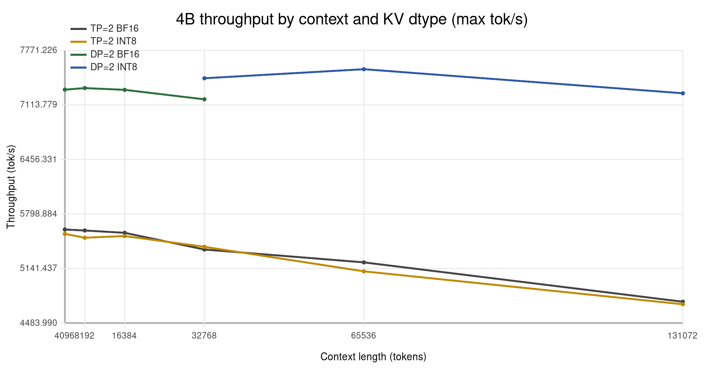

# Gemma 3 27B on Dual RTX 3090

Optimized vLLM configuration for running Gemma 3 27B IT on consumer hardware.

## Performance

| Metric | BF16 KV | INT8 KV | Notes |
|--------|---------|---------|-------|
| Short context (<4K) | 67 tok/s | 61 tok/s | -9%, compute-bound |
| Long context (7K) | 24 tok/s | **45 tok/s** | **+87%**, memory-bound |
| Max context | 32K | **128K** | 4x with same VRAM |
| KV cache memory | 23 GB | 11.5 GB | -50% |

INT8 KV cache trades 9% short-context overhead for +87% long-context speedup and 4x max context.

## Quick Start

```bash
./scripts/launch-server-final.sh    # Recommended: INT8-K + FP8-V, per-layer scales, 64K context
./scripts/launch-server.sh          # BF16 KV cache, 8K context (faster startup)
```

Server starts on `http://localhost:8000`. First startup takes ~2 minutes for CUDA graph capture.

```bash
curl http://localhost:8000/v1/chat/completions \
    -H "Content-Type: application/json" \
    -d '{"model": "RedHatAI/gemma-3-27b-it-quantized.w4a16",
         "messages": [{"role": "user", "content": "Hello!"}]}'
```

## Requirements

- 2x RTX 3090 (48GB total VRAM)
- NVLink bridge (NV4 recommended)
- Python 3.10+, vLLM 0.17.1

## Documentation

- [Setup Guide](docs/setup-guide.md) - Hardware requirements, installation, troubleshooting
- [Quantization Methods](docs/quantization-methods.md) - Model comparison (W4A16 vs GPTQ)
- [ExLlamaV2 Alternative](docs/exllamav2-alternative.md) - Alternative inference engine

## Research

1. [CUDA Graph Optimization](research/01-cuda-graph-optimization.md) - 3x speedup discovery
2. [Context Scaling](research/02-context-scaling.md) - 8K to 128K with no speed loss
3. [Long Context Bottleneck](research/03-long-context-bottleneck.md) - Memory bandwidth analysis
4. [Quality Testing](research/04-dutch-quality-test.md) - Dutch summarization comparison
5. [SGLang Comparison](research/05-sglang-comparison.md) - vLLM wins on RTX 3090
11. [INT8 KV Cache](research/11-int8-kv-cache.md) - 2x memory savings, +87% long context speed
12. [Qwen 3.5 Comparison](research/12-qwen35-comparison.md) - DeltaNet vs Gemma 3 hybrid attention
13. [CUDA Graphs & Cascade](research/13-cuda-graphs-cascade-analysis.md) - Why cascade attention is a red herring

## Scripts

| Script | Context | Description |
|--------|---------|-------------|
| `scripts/launch-server-final.sh` | 64K | **Recommended** - INT8-K + FP8-V, per-layer scales |
| `scripts/launch-server.sh` | 8K | BF16 KV cache, fastest startup |
| `scripts/launch-server-32k.sh` | 32K | BF16 KV cache, medium context |
| `scripts/launch-server-128k.sh` | 128K | BF16 KV cache, full context |
| `scripts/launch-server-int8.sh` | 64K | INT8 (global scale, superseded by final) |
| `scripts/launch-server-int8-per-layer.sh` | 64K | INT8 with per-layer scales |
| `scripts/launch-server-int8k-fp8v.sh` | 64K | INT8-K + FP8-V hybrid |
| `scripts/benchmark.py` | - | Performance measurement |
| `scripts/quality_compare.py` | - | Quality testing with Dutch text |

## Key Findings

- **CUDA Graphs require `--disable-custom-all-reduce`** on RTX 3090
- **FULL_DECODE_ONLY mode** enables graphs on 24GB GPUs
- **W4A16 quantization** fits full 128K context in 48GB VRAM
- **NVLink NV4** provides ~112 GB/s bidirectional bandwidth
- **INT8 KV cache** halves KV memory, +87% speed for >4K tokens (requires vLLM patch)

## INT8 KV Cache (RTX 3090 / Ampere)

RTX 3090 lacks FP8 hardware. We implemented quantized KV cache via Triton with two key
optimizations that recover precision lost by naive INT8 quantization:

### Per-Layer Scales

A single global scale for 62 attention layers wastes precision. Layer 42 has v_absmax=884,
layer 59 has v_absmax=2.6 — a 340x ratio. Per-layer calibration gives each layer the full
INT8 dynamic range.


### INT8-K + FP8-V Emulation

K (keys) use INT8 — linear quantization error translates linearly to softmax input.
V (values) use FP8-E4M3 emulated in INT8 storage — logarithmic spacing preserves relative
precision across the heavy-tailed distributions in deeper layers. No hardware FP8 required.

---

### Patch Installation

The venv in this repository already has all INT8 modifications applied. For a fresh vLLM installation,
the patch files document the required changes.

**What the patches modify:**

| File | Change |
|------|--------|
| `config/cache.py` | Adds `"int8"` to `CacheDType` literal |
| `v1/attention/backend.py` | Extends `is_quantized_kv_cache()` for INT8 |
| `v1/attention/backends/triton_attn.py` | Adds `"int8"` to supported dtypes list |
| `v1/attention/ops/triton_reshape_and_cache_flash.py` | INT8 quantization kernel with optional FP8-V emulation |
| `v1/attention/ops/triton_unified_attention.py` | INT8 dequantization kernel with FP8-V decode |
| `model_executor/layers/attention/attention.py` | INT8 range (127), CUDA graph fix, warmup handling |

**Patch files (documentation of changes):**
- `patches/vllm-int8-kv-cache.patch` - Basic INT8-only support
- `patches/vllm-int8-kv-cache-with-fp8v.patch` - Full INT8-K + FP8-V hybrid with per-layer scales

**For fresh install:**
```bash
# Clone this repo and use the pre-patched venv
git clone https://github.com/[repo]/gemma-optimization
cd gemma-optimization
source venv/bin/activate

# Or apply manually to your vLLM 0.17.1 installation:
# 1. Review patches/vllm-int8-kv-cache-with-fp8v.patch for changes
# 2. Apply modifications to corresponding files in your vLLM installation
# 3. Run: python scripts/apply_per_layer_scales_patch.py
```

---

### Running the Server

**Recommended (INT8-K + FP8-V with per-layer scales):**
```bash
./scripts/launch-server-final.sh
```

**Manual launch with all arguments:**
```bash
# Environment variables
export VLLM_INT8_V_FP8_EMUL=1                              # Enable FP8-V emulation (recommended)
export VLLM_KV_SCALES_FILE=scales/gemma3_27b_per_layer.json  # Per-layer calibrated scales

# Launch server
vllm serve RedHatAI/gemma-3-27b-it-quantized.w4a16 \
    --tensor-parallel-size 2 \
    --disable-custom-all-reduce \
    --kv-cache-dtype int8 \
    --compilation-config '{"cudagraph_mode": "FULL_DECODE_ONLY", "cudagraph_capture_sizes": [1, 2, 4, 8, 16, 32]}' \
    --max-model-len 65536 \
    --gpu-memory-utilization 0.90 \
    --port 8000
```

**Command line arguments explained:**

| Argument | Value | Purpose |
|----------|-------|---------|
| `--tensor-parallel-size` | `2` | Split model across 2 GPUs |
| `--disable-custom-all-reduce` | - | Required for CUDA graphs on RTX 3090 |
| `--kv-cache-dtype` | `int8` | Enable INT8 KV cache (requires patch) |
| `--compilation-config` | `{...}` | Enable CUDA graphs for decode phase |
| `--max-model-len` | `65536` | Maximum context length (up to 128K) |
| `--gpu-memory-utilization` | `0.90` | Leave headroom for CUDA graph capture |
| `--port` | `8000` | API server port |

**Environment variables:**

| Variable | Value | Purpose |
|----------|-------|---------|
| `VLLM_INT8_V_FP8_EMUL` | `1` | Use FP8-E4M3 emulation for V cache (handles 340x variance) |
| `VLLM_KV_SCALES_FILE` | `path/to/scales.json` | Per-layer calibrated scales file |

---

### Optional: Re-calibrate Scales for Your Workload

Pre-calibrated scales are provided in `scales/gemma3_27b_per_layer.json`. To calibrate for your specific workload:

```bash
# Run calibration with representative text
python scripts/calibrate_kv_scales.py \
    --model RedHatAI/gemma-3-27b-it-quantized.w4a16 \
    --text-file your_calibration_text.txt \
    --output scales/your_custom_scales.json

# Use your custom scales
export VLLM_KV_SCALES_FILE=scales/your_custom_scales.json
```

Calibration typically takes 5-10 minutes and requires ~24GB VRAM.

---

### 4B Model with Data Parallelism (Maximum Throughput)

For smaller models, data parallelism (DP=2) beats tensor parallelism (TP=2) by +30-45%.
INT8 KV cache enables DP at long context where BF16 OOMs.

```bash
# 4B W4A16 with DP=2 + INT8 (7,500 tok/s at 64K context)
vllm serve RedHatAI/gemma-3-4b-it-quantized.w4a16 \
    --data-parallel-size 2 \
    --tensor-parallel-size 1 \
    --kv-cache-dtype int8 \
    --calculate-kv-scales \
    --compilation-config '{"cudagraph_mode": "FULL_DECODE_ONLY", "cudagraph_capture_sizes": [1,2,4,8,16,32,64,128,256]}' \
    --max-model-len 131072 \
    --gpu-memory-utilization 0.85 \
    --port 8000

# 1B W8A8 with DP=2 (12,500 tok/s - fastest config)
vllm serve RedHatAI/gemma-3-1b-it-quantized.w8a8 \
    --data-parallel-size 2 \
    --tensor-parallel-size 1 \
    --compilation-config '{"cudagraph_mode": "FULL_DECODE_ONLY", "cudagraph_capture_sizes": [1,2,4,8,16,32,64,128,256]}' \
    --max-model-len 32768 \
    --gpu-memory-utilization 0.85 \
    --port 8000
```

---

| Config | Performance | Quality |
|--------|-------------|---------|
| BF16 KV | 67 tok/s | Baseline |
| INT8 global scale | 67 tok/s | Precision loss in some layers |
| **INT8-K + FP8-V per-layer** | **67 tok/s** | **No degradation** |

### INT8 Enables Data Parallelism at Long Context (4B model)

With the smaller Gemma 3 4B model, INT8 KV cache unlocks data parallelism (DP=2) at long context
where BF16 would OOM. DP=2 + INT8 achieves +45% higher throughput than TP=2 + BF16 at 128K context.



| Context | TP=2 BF16 | TP=2 INT8 | DP=2 BF16 | DP=2 INT8 |
|---------|-----------|-----------|-----------|-----------|
| 32K | 5,371 | 5,403 | 7,182 | **7,435** |
| 64K | 5,216 | 5,108 | OOM | **7,545** |
| 128K | 4,741 | 4,711 | OOM | **7,254** |

Batch size: 256 concurrent requests. Throughput in tokens/second.

See [research/11-int8-kv-cache.md](research/11-int8-kv-cache.md) for implementation details.
