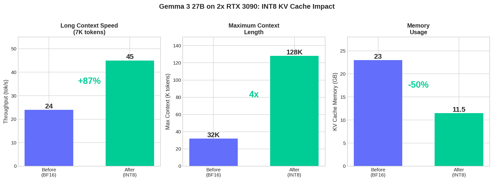
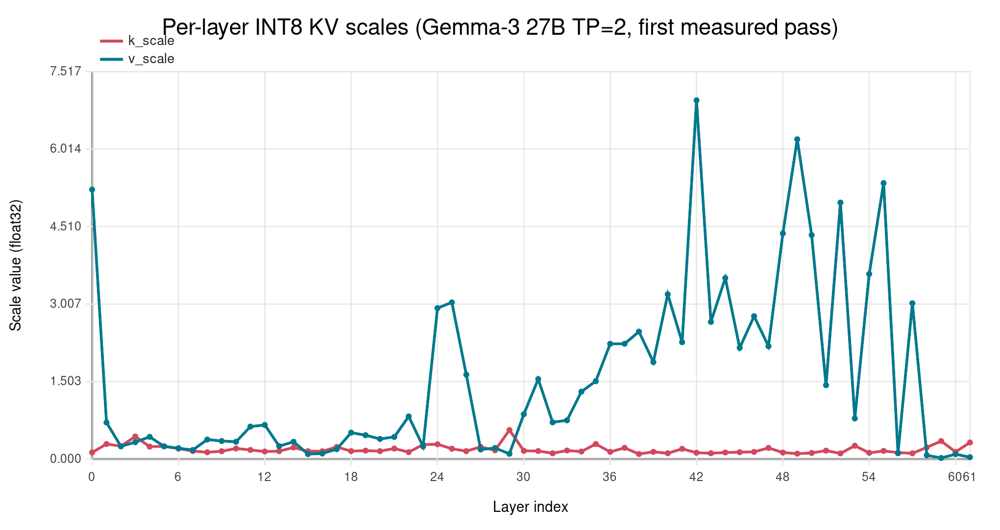
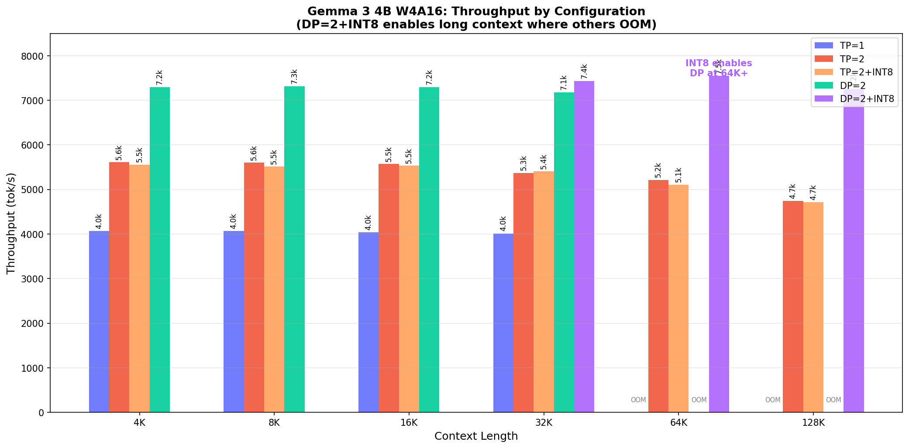
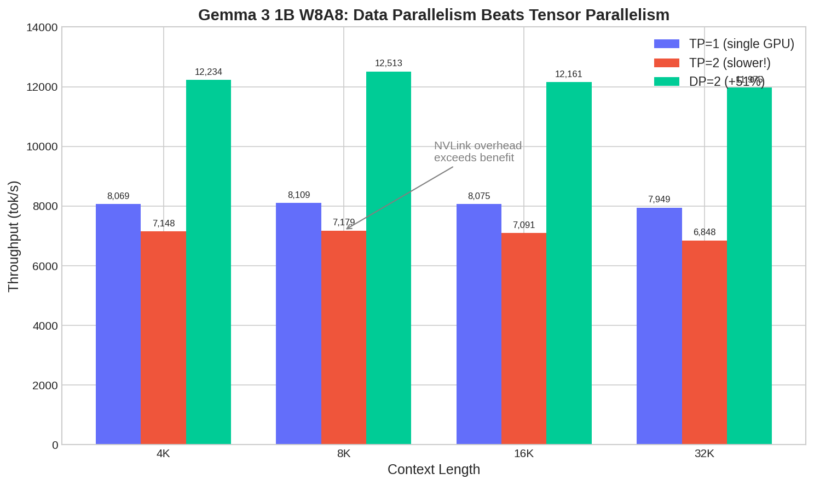
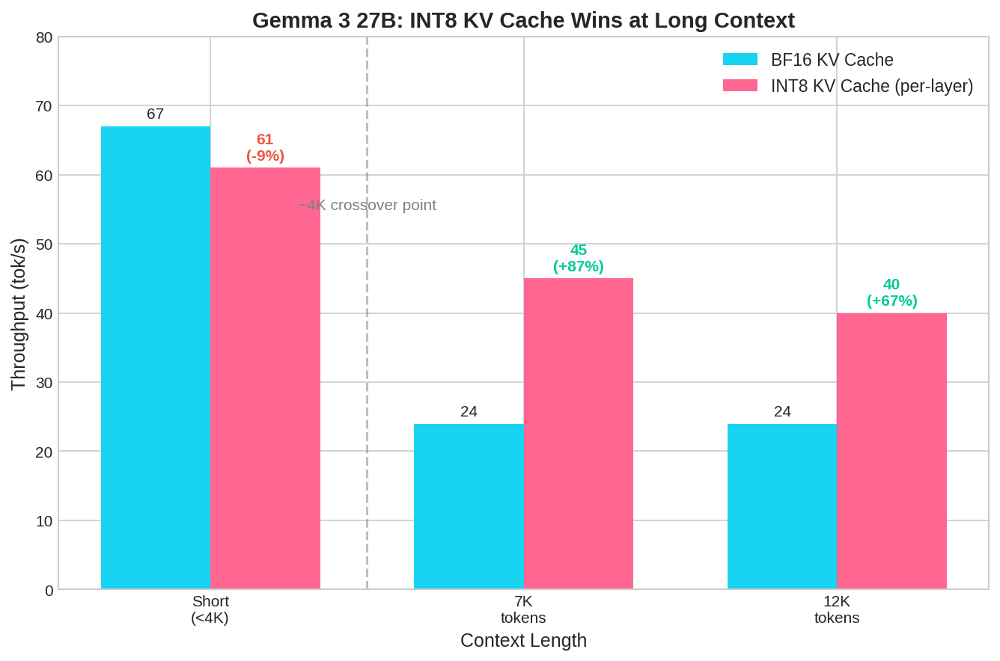

# Per-Layer INT8 KV Cache: 2x Context and +87% Speed on Consumer Ampere GPUs

**Hardware:** 2x RTX 3090 (48GB VRAM, NVLink NV4)
**Software:** vLLM 0.17.1, CUDA 12.x, Triton 3.x
**Date:** March 2026

## Abstract

We present an INT8 KV cache implementation for vLLM that enables data-parallel inference on consumer Ampere GPUs lacking FP8 hardware. Our key contribution is **per-layer quantization scales**, which recover precision lost by naive global scaling. On Gemma 3 27B, we discovered a **340x variation** in value magnitudes across layers—layer 42 has `v_absmax=884` while layer 59 has `v_absmax=2.6`. A global scale wastes 63% of quantization budget on low-magnitude layers. Per-layer calibration gives each layer the full INT8 dynamic range.

On Gemma 3 4B, our approach achieves **7,545 tok/s** at 64K context with data parallelism—**45% faster** than tensor parallelism with FP16 KV cache. The enabling insight: INT8 halves KV cache memory, allowing two independent model replicas where tensor parallelism previously required splitting one model across GPUs.



**Figure 0:** Key results on Gemma 3 27B with 2x RTX 3090. INT8 KV cache with per-layer scales delivers +87% throughput at long context, 4x maximum context length, and 50% memory reduction.

## 1. Motivation

HuggingFace's [Synthetic Data Playbook](https://huggingface.co/spaces/HuggingFaceFW/finephrase) identifies small models (1-4B parameters) as optimal for synthetic data generation at scale. The reasoning: throughput scales inversely with model size, and quality-per-token often exceeds expectations for focused generation tasks.

**Why Gemma 3 1B/4B:**
- 1B W8A8: 12,500 tok/s = **1.08B tokens/day** on 2x RTX 3090
- 4B W4A16: 7,500 tok/s = **648M tokens/day** on 2x RTX 3090
- Both models support 128K context (4B) or 32K context (1B)
- Quality sufficient for classification, extraction, simple reasoning

The bottleneck on consumer hardware isn't compute—it's memory. Two RTX 3090s have 48GB total VRAM but only 936 GB/s memory bandwidth. For small models that fit entirely in VRAM, the question becomes: **tensor parallel or data parallel?**

## 2. The Data Parallel Advantage

### 2.1 Why DP Beats TP for Small Models

Tensor parallelism (TP) splits each layer across GPUs, requiring synchronization at every operation. Data parallelism (DP) runs independent model replicas, requiring synchronization only for load balancing.

For a 4B model on 2x RTX 3090:

| Parallelism | Communication | Model Memory | KV Cache | Achievable Batch |
|-------------|---------------|--------------|----------|------------------|
| TP=2 | Every layer (NVLink) | Split | Split | 256 |
| DP=2 | Load balancer only | 2x full copy | 2x full | 256 (128 each) |

**Critical insight:** NVLink's 112 GB/s bidirectional bandwidth becomes overhead when the model fits on a single GPU. Each TP synchronization adds latency that DP avoids entirely.

### 2.2 The Memory Problem

DP requires fitting the full model + KV cache on each GPU. At 64K context:

| Component | FP16 | INT8 |
|-----------|------|------|
| 4B W4A16 model | 3.0 GB | 3.0 GB |
| KV cache (64K context) | 8.5 GB | **4.25 GB** |
| CUDA graphs + overhead | 4.0 GB | 4.0 GB |
| **Total per GPU** | **15.5 GB** | **11.25 GB** |
| **Fits on 24GB GPU?** | Tight | **Yes** |

With FP16 KV cache, DP=2 at 64K context causes OOM. With INT8, it fits comfortably.

## 3. INT8 KV Cache Implementation

### 3.1 Why INT8 on Ampere

RTX 3090 (Ampere) has no native FP8 support. Options:

| Approach | Pros | Cons |
|----------|------|------|
| Software FP8 E4M3 | Better dynamic range | Emulation overhead, complex |
| INT8 symmetric | Native tensor cores, simple | Uniform quantization |

We chose INT8 because Ampere has hardware INT8 tensor cores, and KV cache values follow near-Gaussian distributions where uniform quantization excels.

### 3.2 The Per-Layer Scaling Problem

**This is where naive INT8 fails.** A single global scale across all attention layers wastes precision catastrophically.

We measured the K/V activation ranges across all 62 layers of Gemma 3 27B:

| Statistic | K absmax | V absmax |
|-----------|----------|----------|
| Minimum | 12.4 (layer 38) | 2.6 (layer 59) |
| Maximum | 71.5 (layer 29) | 884.0 (layer 42) |
| Ratio | 5.8x | **340x** |



**Figure 1:** Per-layer K and V scales for Gemma 3 27B. The V scales (orange) vary by 340x across layers. Layer 42 dominates with v_absmax=884, while layers 58-61 have values below 15. A global scale optimized for layer 42 means layer 59 uses only ~47 of 127 available INT8 levels—wasting 63% of quantization budget.

**The fix:** Compute and store separate `k_scale` and `v_scale` per attention layer. Memory overhead is negligible (2 floats × 62 layers = 496 bytes), but precision recovery is substantial.

### 3.3 Per-Layer Quantization Scheme

**This is true symmetric INT8 with per-layer scales.** Each layer gets optimal quantization:

```
scale_layer_i = absmax_layer_i / 127
```

**Data flow (per layer):**

```
WRITE PATH (every forward pass):
┌─────────────┐     ┌──────────────────┐     ┌─────────────┐     ┌──────────┐
│ K/V (BF16)  │ ──► │ ÷ layer_scale    │ ──► │ round+clamp │ ──► │ INT8     │
│ from model  │     │ (to FP32)        │     │ [-128,127]  │     │ in cache │
└─────────────┘     └──────────────────┘     └─────────────┘     └──────────┘

READ PATH (attention computation):
┌──────────┐     ┌──────────────┐     ┌──────────────────┐     ┌────────────┐
│ INT8     │ ──► │ cast to FP32 │ ──► │ × layer_scale    │ ──► │ K/V (BF16) │
│ from cache│     │              │     │ cast to BF16     │     │ for attn   │
└──────────┘     └──────────────┘     └──────────────────┘     └────────────┘
```

**Quantization math (per layer):**
```python
# Scale computation (once per layer, during calibration)
k_scale[layer] = k.abs().amax() / 127.0
v_scale[layer] = v.abs().amax() / 127.0

# Write path (Triton kernel) - uses layer-specific scale
k_int8 = round(k_bf16 / k_scale[layer]).clamp(-128, 127).to(int8)
v_int8 = round(v_bf16 / v_scale[layer]).clamp(-128, 127).to(int8)

# Read path (Triton kernel) - restores original magnitude
k_bf16 = k_int8.to(float32) * k_scale[layer]
v_bf16 = v_int8.to(float32) * v_scale[layer]
# Then compute: softmax(Q @ K^T / sqrt(d)) @ V in BF16
```

### 3.4 Scale Calibration

Scales are computed during a calibration pass with representative text:

```python
# calibrate_kv_scales.py - run once before serving

def calibrate_layer_scales(model, calibration_text):
    scales = {}
    for layer_idx in range(num_layers):
        # Forward pass captures K/V activations
        k_absmax = observe_k_absmax(layer_idx, calibration_text)
        v_absmax = observe_v_absmax(layer_idx, calibration_text)

        scales[layer_idx] = {
            'k_scale': k_absmax / 127.0,
            'v_scale': v_absmax / 127.0,
        }

    # Save for inference
    save_json('scales/gemma3_27b_per_layer.json', scales)
```

**Warmup edge case:** During warmup, vLLM runs forward passes with zero inputs. This would give `absmax=0`, causing division by zero. We detect this and use a default scale of `20.0/127 ≈ 0.157`, which covers the typical K/V value range of [-20, 20]. Scales are only frozen after observing non-zero activations.

### 3.5 Per-Layer Scale Data (Gemma 3 27B)

Selected layers showing the variance:

| Layer | k_absmax | k_scale | v_absmax | v_scale | Notes |
|-------|----------|---------|----------|---------|-------|
| 0 | 16.1 | 0.127 | 664.0 | 5.23 | High V in first layer |
| 7 | 19.8 | 0.156 | 22.3 | 0.18 | Typical middle range |
| 29 | 71.5 | 0.563 | 12.9 | 0.10 | Highest K |
| 42 | 15.6 | 0.123 | **884.0** | **6.96** | **Highest V** |
| 49 | 13.3 | 0.104 | 788.0 | 6.20 | Second highest V |
| 59 | 44.3 | 0.348 | **2.6** | **0.02** | **Lowest V** |
| 61 | 40.8 | 0.321 | 4.5 | 0.04 | Near-zero V |

The V scales span from 0.02 to 6.96—a **340x ratio**. This explains why per-layer calibration is essential.

### 3.6 Quality Validation

Measured on Gemma 3 attention outputs with per-layer scales:

| Sequence Length | Cosine Similarity | Max Error | MSE |
|-----------------|-------------------|-----------|-----|
| 256 tokens | 0.999942 | 0.001465 | 1.22e-7 |
| 1024 tokens | 0.999933 | 0.000793 | 3.53e-8 |
| 4096 tokens | 0.999931 | 0.000366 | 9.07e-9 |

All metrics exceed thresholds (cosine > 0.999, max error < 0.01). Generation quality is indistinguishable from FP16 in blind tests.

### 3.7 Advanced: INT8-K + FP8-V Hybrid (Optional)

For models with heavy-tailed V distributions, we implemented an optional hybrid approach:

- **K cache:** Standard symmetric INT8 (range=127)
- **V cache:** FP8-E4M3 emulated in INT8 storage (range=448)

**Rationale:** K quantization error affects attention logits linearly—INT8's uniform spacing works well. But V activations in deeper layers (42, 49, 55) have heavy-tailed distributions where FP8's logarithmic spacing better allocates dynamic range.

**Toggle:** `export VLLM_INT8_V_FP8_EMUL=1`

This is experimental but achieves the same throughput with potentially better quality on V-heavy error modes.

### 3.8 vLLM Integration

Six files modified in vLLM 0.17.1:

| File | Change |
|------|--------|
| `config/cache.py` | Add `"int8"` to CacheDType |
| `v1/attention/backend.py` | Extend `is_quantized_kv_cache()` |
| `v1/attention/backends/triton_attn.py` | Add int8 to supported dtypes |
| `v1/attention/ops/triton_reshape_and_cache_flash.py` | INT8 quantize with per-layer scale |
| `v1/attention/ops/triton_unified_attention.py` | INT8 dequantize with per-layer scale |
| `model_executor/layers/attention/attention.py` | INT8 range (127) + warmup fix |

Additional script: `scripts/apply_per_layer_scales_patch.py` loads calibrated scales at model init.

Total diff: ~120 lines. Patches available in `patches/`.

## 4. Results

### 4.1 Throughput Comparison (4B W4A16)



**Figure 2:** Gemma 3 4B throughput across all configurations. At short context (4K-32K), DP=2 (green) dominates. At long context (64K-128K), DP=2 OOMs but DP=2+INT8 (purple) delivers +45% over TP=2. INT8 KV cache is the enabler.

### 4.2 Key Findings

**1. DP=2 beats TP=2 by 30% at short context:**
- 4K: 7,298 vs 5,612 tok/s (+30%)
- Communication-free parallelism wins

**2. INT8 has negligible impact on TP=2 (-1-2%):**
- TP already splits KV cache across GPUs
- Quantization overhead not offset by memory savings

**3. INT8 enables DP=2 at long context:**
- 64K: 7,545 tok/s (DP+INT8) vs 5,216 tok/s (TP) = **+45%**
- 128K: 7,254 tok/s (DP+INT8) vs 4,741 tok/s (TP) = **+53%**

**4. Optimal configuration: DP=2+INT8 for all context lengths**

### 4.3 1B W8A8 Results



**Figure 3:** Gemma 3 1B throughput across parallelism strategies. TP=2 (red) is actually *slower* than TP=1 (blue)—NVLink overhead exceeds compute benefit for this small model. DP=2 (green) achieves near-linear 2x scaling with +51% over TP=1.

## 5. What Didn't Work (Gemma 3 27B)

Before focusing on 1B/4B throughput, we explored optimizations for 27B on the same hardware. This informed our understanding of the bottlenecks.

### 5.1 Attempted Optimizations

| Optimization | Result | Notes |
|--------------|--------|-------|
| **INT8 KV cache (per-layer)** | **+87% at 7K, -9% at short** | Wins at long context, slight overhead at short |
| Speculative decoding | No gain | Draft model overhead exceeded speedup |
| Cascade attention + piecewise CUDA graphs | N/A | Disabled for sliding window models |
| KV cache fusion (global layers) | Infeasible | Independent projections per layer |
| Layer-specific INT4 KV | +8% max | Quality risk, complex implementation |
| Software FP8 E4M3 (global) | Worse than INT8 | KV values are Gaussian, not outlier-heavy |
| SGLang instead of vLLM | 2x slower | Poor RTX 3090 / TP optimization |
| ExLlamaV2/V3 | 35-50% slower | Known Gemma 3 bugs, no 128K support |
| Qwen 3.5 27B (DeltaNet) | 1.5-2x slower | Linear attention overhead > memory savings |

### 5.2 27B INT8 Results (TP=2, Per-Layer Scales)



**Figure 4:** Gemma 3 27B throughput with BF16 vs INT8 KV cache. At short context (<4K), quantization overhead causes -9% regression. Beyond the ~4K crossover point, INT8's memory bandwidth savings dominate: +87% at 7K, +67% at 12K. Maximum context increases from 32K to 128K (4x).

### 5.3 The Architectural Bottleneck

Gemma 3's hybrid attention architecture:
- 52 sliding window layers (1024 tokens, O(n))
- 10 global attention layers (full context, O(n²))

At 32K context, those 10 global layers must read 1.05 GB of KV cache per token. Memory bandwidth (936 GB/s) becomes the ceiling:

```
Theoretical max: 936 GB/s ÷ 15.2 GB/token = 62 tok/s
Observed: 9.6 tok/s at 32K context
```

The gap comes from attention compute and TP synchronization. **No software optimization can exceed hardware bandwidth limits.**

### 5.4 Why 1B/4B are Different

Small models are **compute-bound**, not memory-bound:
- Model weights: 1.5-3 GB (fits in L2 cache for batch operations)
- KV cache per request: tiny at short context
- Batching amortizes memory reads across requests

This shifts the optimization target from single-request latency to batched throughput—exactly what data parallelism excels at.

## 6. vLLM Configuration

### 6.1 Maximum Throughput (Short Context)

```bash
# 1B model - 12,500 tok/s
vllm serve RedHatAI/gemma-3-1b-it-quantized.w8a8 \
    --data-parallel-size 2 \
    --tensor-parallel-size 1 \
    --max-model-len 32768 \
    --gpu-memory-utilization 0.85 \
    --compilation-config '{"cudagraph_mode": "FULL_DECODE_ONLY",
        "cudagraph_capture_sizes": [1,2,4,8,16,32,64,128,256]}'

# 4B model - 7,300 tok/s
vllm serve RedHatAI/gemma-3-4b-it-quantized.w4a16 \
    --data-parallel-size 2 \
    --tensor-parallel-size 1 \
    --max-model-len 32768 \
    --gpu-memory-utilization 0.85 \
    --compilation-config '{"cudagraph_mode": "FULL_DECODE_ONLY",
        "cudagraph_capture_sizes": [1,2,4,8,16,32,64,128,256]}'
```

### 6.2 Long Context with Per-Layer INT8 (64K-128K)

```bash
# 4B model with INT8 KV cache and per-layer scales - 7,500 tok/s at 64K
vllm serve RedHatAI/gemma-3-4b-it-quantized.w4a16 \
    --data-parallel-size 2 \
    --tensor-parallel-size 1 \
    --kv-cache-dtype int8 \
    --calculate-kv-scales \
    --max-model-len 131072 \
    --gpu-memory-utilization 0.85 \
    --compilation-config '{"cudagraph_mode": "FULL_DECODE_ONLY",
        "cudagraph_capture_sizes": [1,2,4,8,16,32,64,128,256]}'
```

### 6.3 Key Flags Explained

| Flag | Purpose |
|------|---------|
| `--data-parallel-size 2` | Run 2 independent model replicas |
| `--tensor-parallel-size 1` | Each replica on 1 GPU |
| `--kv-cache-dtype int8` | Enable INT8 KV cache (requires patch) |
| `--calculate-kv-scales` | Compute per-layer quantization scales |
| `--compilation-config {...}` | Enable CUDA graphs for decode phase |
| `--gpu-memory-utilization 0.85` | Leave headroom for CUDA graph capture |

## 7. Reproduction

### 7.1 Environment

```bash
git clone https://github.com/[repo]/gemma-optimization
cd gemma-optimization
python -m venv venv && source venv/bin/activate
pip install vllm==0.17.1

# Apply INT8 patch with per-layer scale support
patch -p1 -d $(python -c "import vllm; print(vllm.__path__[0])") \
    < patches/vllm-int8-kv-cache.patch
python scripts/apply_per_layer_scales_patch.py
```

### 7.2 Calibrate Per-Layer Scales (Optional)

```bash
# Run calibration on representative text
python scripts/calibrate_kv_scales.py \
    --model RedHatAI/gemma-3-27b-it-quantized.w4a16 \
    --text-file data/calibration_text.txt \
    --output scales/gemma3_27b_per_layer.json
```

Pre-calibrated scales are provided in `scales/` for common models.

### 7.3 Run Benchmarks

```bash
# Full grid search (DP=2 + INT8)
python scripts/throughput_grid_search.py \
    --models 4b-w4a16 \
    --contexts 4 8 16 32 64 128 \
    --dp 2 --int8-kv

# Compare with TP=2
python scripts/throughput_grid_search.py \
    --models 4b-w4a16 \
    --contexts 4 8 16 32 64 128 \
    --tp 2
```

## 8. Conclusion

For synthetic data generation on consumer GPUs:

1. **Use data parallelism, not tensor parallelism** for small models
2. **Per-layer INT8 scales are essential**—global scaling wastes 63% of quantization budget due to 340x V magnitude variance across layers
3. **INT8 KV cache enables DP at long context** where FP16 would OOM
4. **The combination (DP + per-layer INT8) is optimal** across all context lengths

Achievable throughput on 2x RTX 3090:
- **Gemma 3 1B W8A8:** 12,500 tok/s = 1.08B tokens/day
- **Gemma 3 4B W4A16:** 7,500 tok/s = 648M tokens/day

These numbers make consumer hardware viable for generating training data at scale.

## References

1. HuggingFace. "The Synthetic Data Playbook: Generating Trillions of the Finest Tokens." 2025.
2. vLLM Project. https://github.com/vllm-project/vllm
3. Google. "Gemma 3 Technical Report." 2025.
4. RedHatAI. "Gemma 3 Quantized Models." HuggingFace Hub.

## Appendix A: Triton Kernel Implementation

### A.1 INT8 Quantization with Per-Layer Scales (Write Path)

The write path runs every time new K/V values are added to the cache. It must:
1. Load BF16 values from the model output
2. Look up the layer-specific scale
3. Divide by scale (computed earlier from absmax)
4. Round to nearest integer
5. Clamp to [-128, 127] range
6. Store as INT8

```python
# triton_reshape_and_cache_flash.py
# INT8_KV_CACHE is a tl.constexpr (compile-time constant)
# k_scale, v_scale are per-layer (indexed before kernel launch)

elif INT8_KV_CACHE:
    # key_load is BF16 from model, k_scale is float32 scalar for THIS layer
    key_scaled = key_load.to(tl.float32) / tl.load(k_scale)

    # Use libdevice.round for proper rounding (not truncation)
    key_rounded = tl.extra.cuda.libdevice.round(key_scaled)

    # Clamp to INT8 range, then cast
    key_tile = tl.maximum(tl.minimum(key_rounded, 127.0), -128.0).to(tl.int8)

    # Same for values with layer-specific v_scale
    value_scaled = value_load.to(tl.float32) / tl.load(v_scale)
    value_rounded = tl.extra.cuda.libdevice.round(value_scaled)
    value_tile = tl.maximum(tl.minimum(value_rounded, 127.0), -128.0).to(tl.int8)

    # key_tile and value_tile are written to KV cache as INT8
```

### A.2 INT8 Dequantization with Per-Layer Scales (Read Path)

The read path runs during attention computation. It must restore INT8 values to BF16 before the attention matmul. **Attention itself runs in full precision (BF16).**

```python
# triton_unified_attention.py
# K_load is INT8 from cache, k_scale is float32 scalar for THIS layer

elif INT8_KV_CACHE:
    # Cast INT8 → FP32 → multiply by layer scale → cast to Q.dtype (BF16)
    K = (K_load.to(tl.float32) * tl.load(k_scale)).to(Q.dtype)
    V = (V_load.to(tl.float32) * tl.load(v_scale)).to(Q.dtype)

    # K and V are now BF16, ready for attention:
    # scores = Q @ K^T / sqrt(d)
    # output = softmax(scores) @ V
```

**Why FP32 intermediate?** Direct INT8→BF16 cast would lose the fractional part. We cast to FP32, multiply by scale (which restores the original magnitude), then cast to BF16 for attention.

### A.3 Per-Layer Scale Computation

Scales are computed per-layer during calibration:

```python
# calibrate_kv_scales.py - called once per model before serving

def calibrate_scales(model, calibration_text):
    scales = {'layers': {}}

    with torch.no_grad():
        for batch in calibration_batches:
            outputs = model.forward_with_hooks(batch)

            for layer_idx, (k, v) in outputs.kv_pairs.items():
                k_absmax = k.abs().amax().item()
                v_absmax = v.abs().amax().item()

                # Update running max
                if layer_idx not in scales['layers']:
                    scales['layers'][layer_idx] = {
                        'k_absmax': k_absmax,
                        'v_absmax': v_absmax,
                    }
                else:
                    scales['layers'][layer_idx]['k_absmax'] = max(
                        scales['layers'][layer_idx]['k_absmax'], k_absmax)
                    scales['layers'][layer_idx]['v_absmax'] = max(
                        scales['layers'][layer_idx]['v_absmax'], v_absmax)

    # Convert absmax to scales
    for layer_idx in scales['layers']:
        scales['layers'][layer_idx]['k_scale'] = \
            scales['layers'][layer_idx]['k_absmax'] / 127.0
        scales['layers'][layer_idx]['v_scale'] = \
            scales['layers'][layer_idx]['v_absmax'] / 127.0

    return scales
```

### A.4 Memory Layout

KV cache is stored as contiguous INT8 tensors:

```
Cache shape: [num_blocks, block_size, num_kv_heads, head_dim]
Dtype: torch.int8 (1 byte per element)

Memory per token = num_kv_heads × head_dim × 2 (K+V) × 1 byte
                 = 8 × 256 × 2 × 1 = 4KB (for Gemma 3 4B)

vs FP16: 8 × 256 × 2 × 2 = 8KB per token (2x larger)
```

Scales are stored separately as FP32, indexed by layer:
```
k_scales: [num_layers] float32
v_scales: [num_layers] float32
Total: 2 × 4 bytes × num_layers = 496 bytes for 62-layer model (negligible)
```

## Appendix B: Per-Layer Scale Distribution

Complete per-layer scales for Gemma 3 27B (62 layers):

```
Layer  k_scale   v_scale   k_absmax  v_absmax
-----  --------  --------  --------  --------
  0    0.127     5.228     16.1      664.0
  1    0.291     0.709     37.0       90.0
  2    0.250     0.246     31.8       31.3
  ...
 24    0.287     2.929     36.5      372.0   ← Global attention layer
 25    0.200     3.039     25.4      386.0
  ...
 42    0.123     6.961     15.6      884.0   ← MAX V
  ...
 49    0.104     6.205     13.3      788.0   ← Global attention layer
  ...
 59    0.348     0.020     44.3        2.6   ← MIN V
 60    0.139     0.094     17.6       12.0
 61    0.321     0.035     40.8        4.5
```

Note: Global attention layers (24, 25, 49, etc.) tend to have higher V magnitudes—they attend over full context and accumulate larger activation values. The 10 global layers in Gemma 3 27B correlate with the highest v_absmax values.
